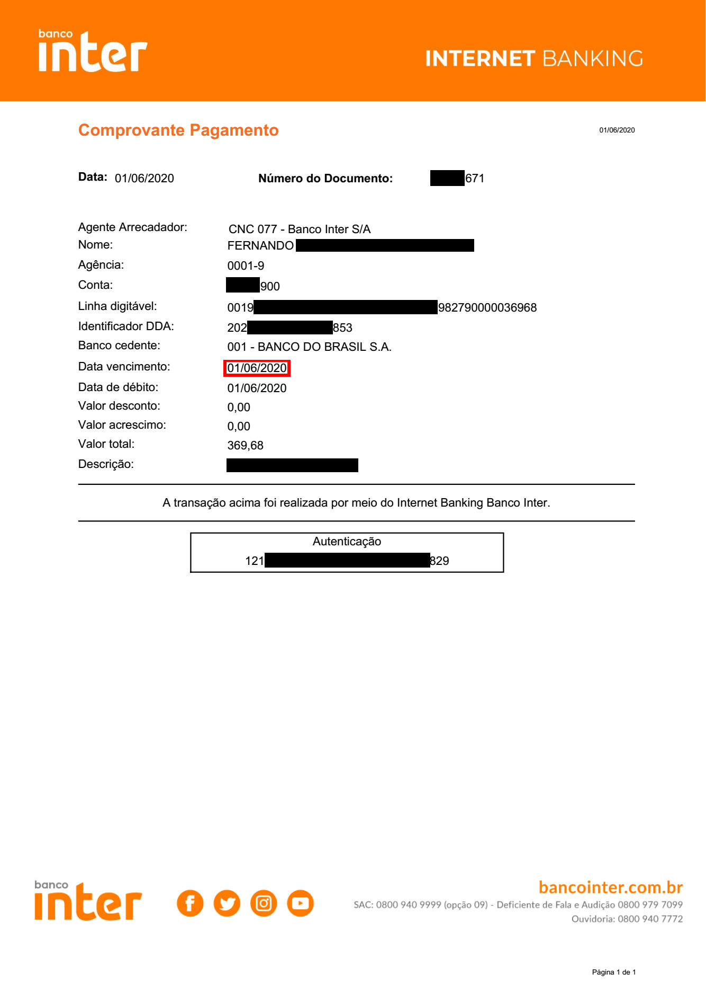
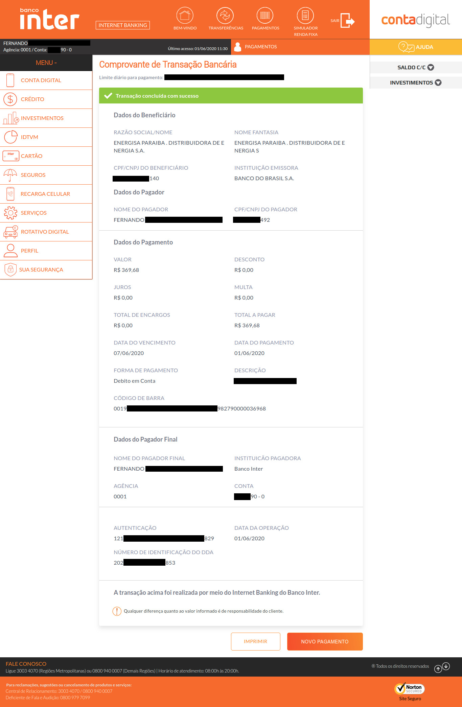

# Bug #2

| Property | Value |
|---|---|
| Given name | **Due date** |
| Feature effected | Customer Chat Service |
| Type | Presentation issue |
| Company | [Banco Inter](https://www.bancointer.com.br/) |
| Reported on | June 11th, 2020 |
| Reporting channel | Customer Chat Service |
| Feedback | N/A |
| Feedback date | N/A |

I had a bill with a due date to 07/JUN/2020 and I paid it on 01/JUN/2020. Nonetheless, on my PDF receipt, both dates appear 01/JUN/2020.

This is the receipt:

This is the confirmation screen:

